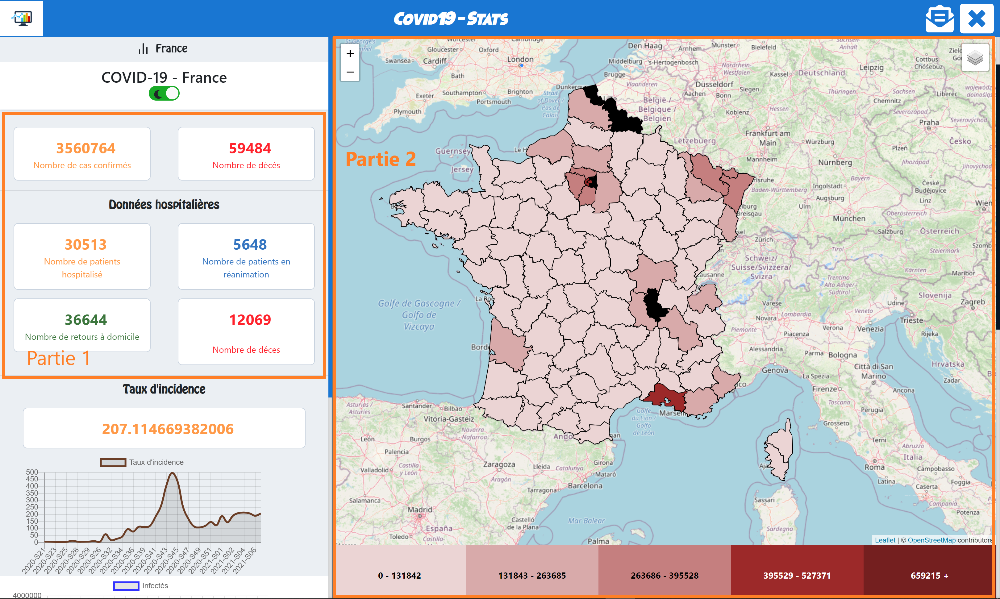
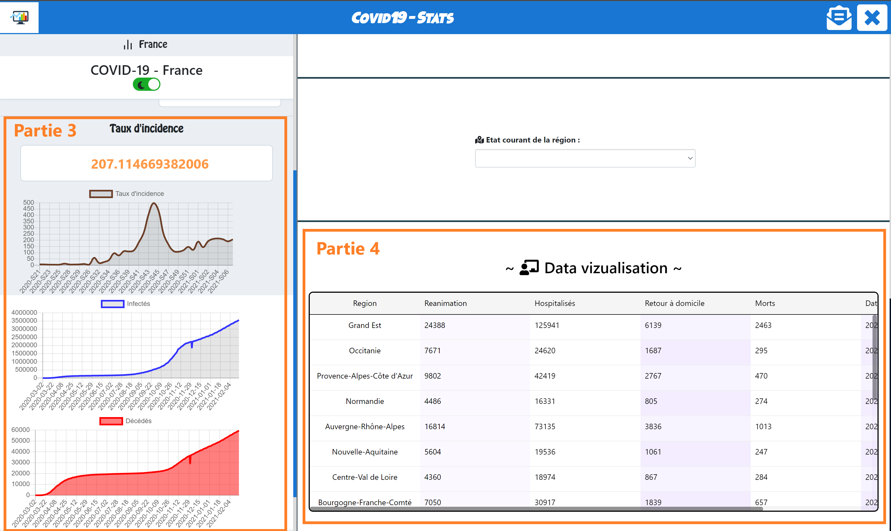
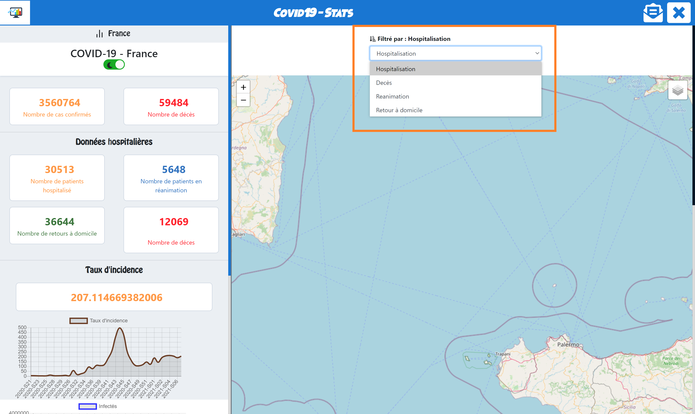
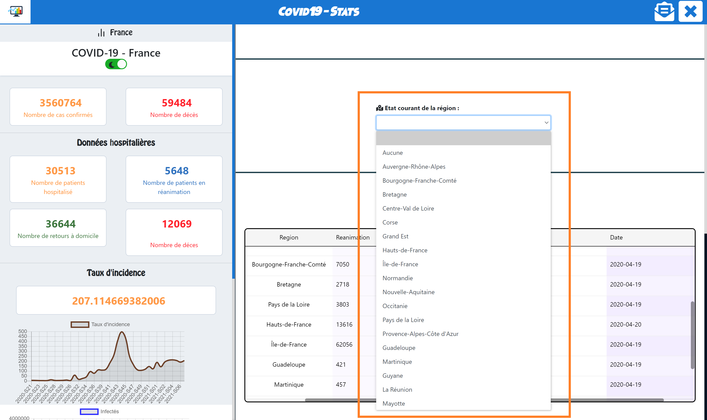
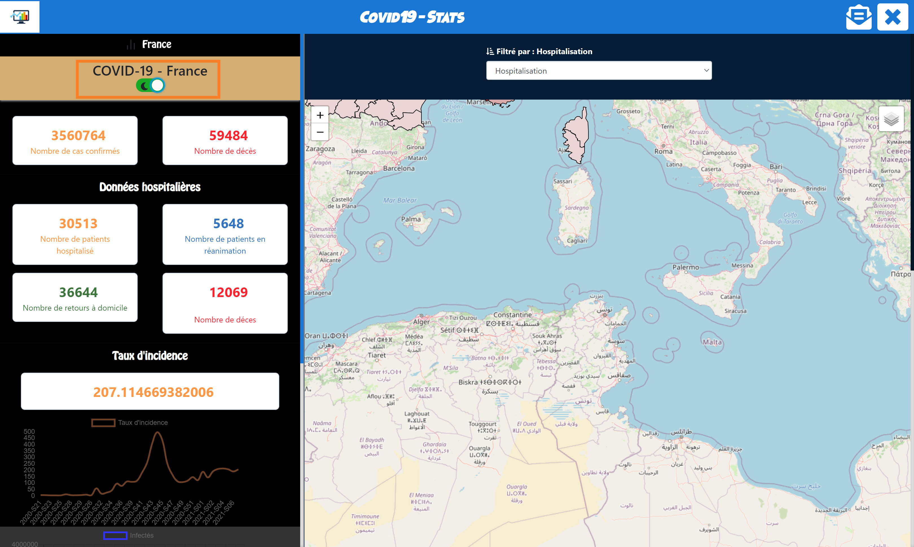
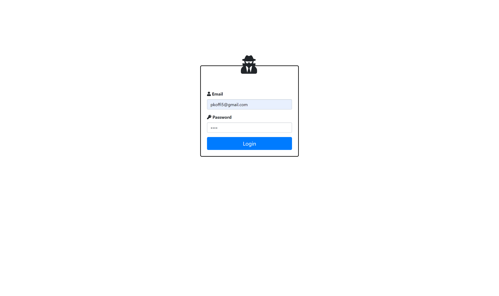
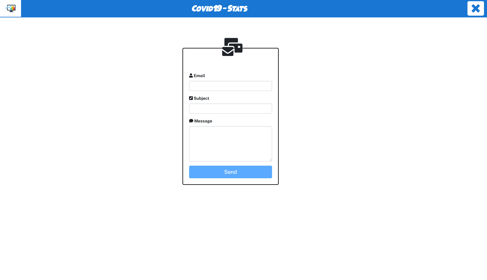

# Programmation web (Server Side ~ Client Side) 2020-2021 - Polytech Nice-Sophia
## Authors: **Team ADKN**
  * AINADOU Florian
  * DJEKINOU Paul-Marie
  * KOFFI Paul
  * NABAGOU Djotiham

## Context of the project
As part of the implementation of web technologies learned during web programming (client side & server side) at Polyech Nice-Sophia, 
we have implemented an application to show the data collected on COVID-19 **only in France** since the appearance of the epidemic. 
To do this, we used official and free-to-use hospital data from the French government. 
These data can be found [here](https://www.data.gouv.fr/fr/datasets/donnees-hospitalieres-relatives-a-lepidemie-de-covid-19).

## Implemented features
**1- visualization :**\
We have implemented 4 types of visualization :
* **A summary in figures** (See following figure - part 1) allowing to have a quick overview of the key figures of the epidemic.
* **A map of France** (See following figure - part 2) produced from [Leaflet](https://react-leaflet.js.org/) and [OpenStreetMap](https://www.openstreetmap.fr/) which provides a visual on the departments and the number of cases identified in each department.\
A legend associated with the map makes it possible to identify the departments from the least impacted to the most impacted.
  <p align="center">
        
    </p>
* **Graphs** (See following figure - part 3) allowing to have an evolution of the epidemic according to the incidence rate, the number of infected cases and the number of deaths.
* **A list (Table)** (See following figure - part 4) allowing to have the figures of people hospitalized, resuscitated, deceased and returns home.
<p align="center">
        
    </p>

**2- Filters :**\
We have implemented filters according to hospitalizations - returns home - resuscitation - deaths which modify the card with each modification and filters according to the regions of France which modify the table when selected (see following figures).
<p align="center">
        
    </p>
<p align="center">
        
    </p>

**3- Theme :**\
On the application, a button allows you to switch from light mode to dark mode and vice versa in order to allow accessibility (see following figures).
<p align="center">
        
    </p>

**4- HTML5 - Database :**\
The browser API is used to detect the user's current region or location.
Statistical data is retrieved from government servers but is not updated regularly because we have set up a database in the backend.
As a result, we retrieved the data available on February 21 at 7:03 p.m. and put it into the database.

**4- Authentication :**\
A login interface is displayed on the home page of the site. To connect, you must enter the following information (see following figure):
  * Email : ``pkoffi5@gmail.com``
  * Password : ``paul``
<p align="center">
        
    </p>

**5- Deployment of the online application :**\
The developed website has been hosted on a server and can be viewed at this address: [Covid Tracking](http://paulkoffi.fr).

**6- Contact form with sending email and validation of fields :**\
A contact form is used to send an email to the user who enters his information in order to keep him informed of the site's statistics.
<p align="center">
        
    </p>

## Project architecture
Our application is subdivided into 3 different parts : the frontend, the backend and the database.\
Statistics on the pandemic are retrieved from the government site and are stored in a MongoDB database.\
The frontend (in react) is addressed to the backend (in node js) to have the data and the backend in turn is addressed to the database to return the stored data.

## How to use this repository ?
* The `main` branch (the default branch) contains the latest stable version of the system.
* The `develop` branch represents the system under development in parallel with other development branches specific to functionalities or relating to the various assigned tasks.
    * Issues can be created using the [Github ticket system](https://github.com/wak-nda/prog-web-ADKN/issues)

### Project cloning
1. Perform a classic clone of the project by making ```git clone https://github.com/wak-nda/prog-web-ADKN.git``` or by getting the zip from this page.
2. By default, you are on the Main branch, otherwise switch to Main.
3. At the root of the project are the [frontend](./frontend) in React and the [backend](./backend) in Node JS.

### Compilation & Execution
**1- Run online**

The developed website has been hosted on a server and can be viewed at this address: [Covid Tracking](http://paulkoffi.fr). The identifiers to connect are:
* Email : ``pkoffi5@gmail.com``
* Password : ``paul``

**2- Run locally**

* Backend (Node JS)
  * Move to the backend directory located at the root of the project
  * Run the `npm install` command to compile the web project and install all Node JS dependencies.
  * Then run the `npm start` command to start the backend server.
  * The listening port is ``5000``, so requests can be made to the address `http://localhost:5000/`. The list of routes can be found [ici](./backend/app.js)

* Frontend (React)
  * Move to the frontend directory located at the root of the project 
  * Run the `npm install` command to compile the web project and install all React dependencies.
  * Then run the `npm start` command to start the web project (make sure you have started the backend beforehand).
  * The listening port is ``3000``, the site can therefore be consulted at the address `http://localhost:3000/`.
  * A login interface is displayed on the home page of the site. To connect, you must enter the following information:
    * Email : ``pkoffi5@gmail.com``
    * Password : ``paul``
  
